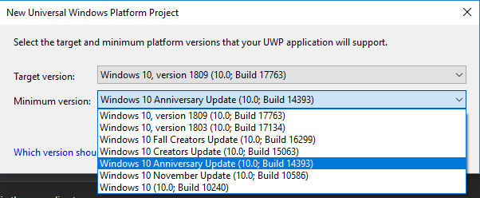
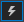
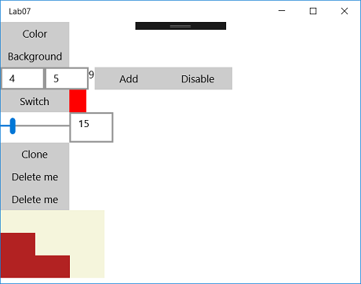

# UWP alapok labor

## Felkészülés a laborra

- Lásd Moodle
- XAML használata felhasználói felülethez:
    - https://docs.microsoft.com/en-us/windows/uwp/xaml-platform/
- UWP App készítési alapok:
    - https://docs.microsoft.com/en-us/visualstudio/get-started/csharp/tutorial-uwp?view=vs-2019
- UWP elrendezés:
    - https://docs.microsoft.com/en-us/windows/uwp/design/layout/
    - https://docs.microsoft.com/en-us/windows/uwp/design/layout/layout-panels
- UWP vezérlők:
    - https://docs.microsoft.com/en-us/windows/uwp/design/controls-and-patterns/

## Hibajavítás

Az App tesztelésénél, ha fura "missing assembly" hibákat kapunk, akkor egy "Build -> Clean Solution" segíthet.

## Leírás

(A labor elején, már most hozz létre egy új branchet és utána azon dolgozz, hogy a pull requestet könnyű legyen majd a labor végén létrehozni! És ha az egyetemen kezdted el a munkát, mielőtt elmész, ne felejtsd el felpusholni a változásokat a laborgépről a githubra!)

Először is hozzunk létre egy üres UWP projektet (Create a new project -> Blank App (Universal Windows)) a LAB07_UWP_Basics\\01 mappába.

A "New Universal Windows Platform Project" ablakban a "Target version" maradhat, a "Minimum version": "Windows 10 Anniversary Update (10.0; Build 14393)" legyen.



A MainPage.xaml fájl az app megjelenítésének leírója, a MainPage.xaml.cs a hozzá tartozó C# kód ("code-behind"). Minden megjelenő elem a Page címkén belül helyezkedik el (\<Page> ... \</Page>). Az első (ős) elem tipikusan egy elrendezésért felelős címke, ilyenek pl.:

- Négyzetrácsos elhelyezés (\<Grid> ... \</Grid>)
- Elemek egymás utáni helyezése (\<StackPanel> ... \</StackPanel>)
- Elemek egymáshoz képesti pozicionálása (\<RelativePanel> ... \</RelativePanel>)

Minden címke tartalmazhat tulajdonságokat, például amik a nevét, méretét, színét, tartalmát, elhelyezkedését stb. határozzák meg. Ha nem adunk meg egy tulajdonságot, akkor az alapértelmezett értéken marad. StackPanel használatánál megadhatjuk, hogy vízszintesen, vagy függőlegesen helyezkedjenek-e el bennük az elemek:

A három gomb egymás alatt helyezkedik el:

```html
<StackPanel Orientation="Vertical">
    <Button Name="firstBtn" Content="First" Width="100" />
    <Button Name="secondBtn" Content="Second" Width="100" />
    <Button Name="thirdBtn" Content="Third" Width="100" />
</StackPanel>
```

A három gomb egymás mellett helyezkedik el:

```html
<StackPanel Orientation="Horizontal">
    <Button Name="firstBtn" Content="First" Width="100" />
    <Button Name="secondBtn" Content="Second" Width="100" />
    <Button Name="thirdBtn" Content="Third" Width="100" />
</StackPanel>
```

Az egyes elemek név (Name="") beállításával a MainPage.xaml.cs kódból elérhetjük az adott elem objektumát és tulajdonságait. Az előző példából kiindulva az első gomb szövegszínének és háttérszínének kódból történő állítása így nézne ki:

```cs
    public MainPage()
    {
        this.InitializeComponent();

        firstBtn.Foreground = new SolidColorBrush(Windows.UI.Colors.LightYellow);
        firstBtn.Background = new SolidColorBrush(Windows.UI.Colors.Green);
    }
```

Az egyes tulajdonságok módosításának módját - ha nem egyértelmű, akkor - egy gyors google kereséssel érthetjük meg.

### Eseménykezelés

Egy felhasználói felület működése során egér- és billentyűzet-eseményekre kell reagálnia. Ilyen események az egér mozgatása, kattintása, a billentyűzet lenyomása stb. Események regisztálása szintén tulajdonságok beállításával történik. Visual Studioban ha kurzorral egy adott elemen állunk, akkor a "Properties" ablak (F4-el előhozható) villámalakú ikonra  kattintva láthatjuk a lehetséges események listáját. A "Properties" ablakban a regiszrálni kívánt eseménynél (pl. "Click" eseménynél), ha az üres mezőbe duplán klikkelünk, akkor a MainPage.xaml.cs fájlban megjelenik az esemény tüzelésekor meghívódó függvény:

```html
    <Button Name="firstBtn" Content="First" Width="100" Click="FirstBtn_Click" />
```
```cs
    private void FirstBtn_Click(object sender, RoutedEventArgs e)
    {

    }
```

## Feladatok

LAB07_UWP_Basics\\01 mappában, a most elkészített projekben dolgozzatok. Minden létrehozott gomb egységes méretű legyen, legyen neve, és tartalmazzon szöveget. Az elemek egymás alatt helyezkedjenek el.

- Hozz létre egy gombot amire ráklikkelve megváltozik a szöveg színe és a gomb háttérszíne.
- Hozz létre egy gombot amire ráklikkelve az ablak háttérszíne két szín között váltogat (minden kattintásra egy váltás).
- Hozz létre két szövegdobozt (TextBox), egy címkét (TextBlock), és két gombot:
    - Ezek az elemek egy sorban helyezkedjenek el.
    - Az első gomb megnyomására a két szövegdobozba beírt számok összegét írja ki a címkébe (itt fontos a hibakezelés).
    - A második gomb megnyomására a két szövegdoboz tiltódjon le, ne lehessen beléjük szöveget írni ("IsEnabled" tulajdonság).
- Hozz létre egy gombot, és három négyzetet (Rectangle):
    - Ezek az elemek egy sorban helyezkedjenek el.
    - Gomb nyomogatására egy szín lépkedjen a négyzeteken sorban, ha végigért a soron akkor kezdje újra az elejétől.
- Hozz létre egy csúszkát és egy szövegdobozt:
    - Ezek az elemek egy sorban helyezkedjenek el.
    - A csúszka változására a szövegdoboz folyamatosan frissüljön a csúszka értékével.
    - A szövegdoboz változására is változzon megfelelően a csúszka értéke.
    - A szövegdobozba csak számot lehessen beírni.
- Hozz létre egy gombot, amire ráklikkelve alatta egy olyan új gomb jelenik meg, amire ha ráklikkelsz eltűnik. Segítség: egy elemhez hozzá lehet adni, és ki lehet törölni gyerek elemeket a \<szülő elem név>.Children lista segítségével. Egy elemhez tartozó eseményre a += operátor segítségével (egy delegate "függvény mutatóval") iratkozhatunk fel:

```cs
{
    btn.Click += Btn_Click;
}

private void Btn_Click(object sender, RoutedEventArgs e)
{
    ...
}
```

- MainPage osztályon belül programozottan hozz létre 3x3 gombot mátrixba rendezve (3 sor, 3 oszlop), mindegyik ugyanolyan háttérszínű legyen, egy space karakter legyen a szövegük:
    - Ezek a gombok két háttérszín között váltakozzanak a következő szerint: ha az egyik gombra ráklikkelsz akkor annak és a közvetlen (merőleges) szomszédainak a színe ellenkezővé kell változzon.
    - A klikkelés eseményhez tartozó logikához mindösszesen egy darab közös függvényre van szükség, ez úgy oldható meg, hogy ha a "sender" argumentumot vizsgáljátok (ez az eseményt kiváltó gomb objektuma, tehát: Button btn = (Button)sender;).
    - A megoldáshoz szükség lesz egy 2D Button tömbre (List\<List\<Button>>), a dinamikusan létrehozott új gombokat ebben kell eltárolni. Ha az egyikre ráklikkelünk, akkor meg kell keresni a klikkelt gombnak a tömbben lévő pozícióit (x,y koordinátáit), ha ezek megvannak, akkor meg kell vizsgálni, hogy a 2D tömbben x és y irányban vannak-e szomszédok, ha igen akkor azoknak is színt kell váltani.
    - Ha minden gombnak megváltozott a színe, akkor írjon ki egy üzenetet (ezt minden gombnyomáskor érdemes megvizsgálni). Az üzenet kiírása így történhet:
```cs
    new Windows.UI.Popups.MessageDialog("You won!").ShowAsync();
```

A feladatok megoldásához egy példa:



### LAB07_UWP_Basics\\02 mappában található feladat

Nyisd meg a LAB07_UWP_Basics\\02\\LAB07_UWP_Basics.sln fájlt és indítsd el a projektet (Debug x64). A létrehozott 3D világban az a feladat, hogy egér és/vagy billentyűzet események segítségével forgasd meg a kamerát, és olvasd el a magad mögött található titkos üzenetet.

A MainPage.xaml.cs fájl 38. sorában található pivotItem3D obejektum eseményeire kell feliratkozni: Viewport3DX_OnMouse3DDown, Viewport3DX_OnMouse3DUp, Viewport3DX_OnMouse3DMove, Viewport3DX_KeyDown. A += operátor leírása során tabulátor segítségével a Visual Studio automatikusan létrehozza az eseményhez tartozó függvény keretét. A pivotItem3D objektum RotateCamera függvényét lehet használni két irányú (vízszintes, függőleges) forgatáshoz.

A Viewport3DX_OnMouse3DMove függvényben a MouseMove3DEventArgs típusú argumentum Position tulajdonsága a jelenlegi egér pozíciójának a koordinátáit adja meg, forgásnál egérlenyomás esetén ezt lenne érdemes az előző pozícióból kivonni.
